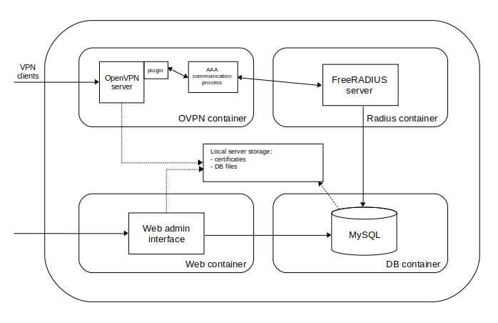

## Charon

Charon is a manageable OpenVPN server deployment made with the sole purpose of simplifying 
the tedious procedure of setting up the PKI environment and managing users for a simple VPN gateway. 

Charon consists of an OpenVPN server, a background FreeRADIUS server for additional password authentication 
and a Java Spring MVC application for certificate and user management. OpenVPN and FreeRADIUS communicate through a 
custom OpenVPN plugin and an accounting process that sends access and accounting requests for clients.
The following diagram shows the components of Charon. 



Upon receiving a client request, OpenVPN checks the validity of the client certificate, 
and then passes the user credentials to the accounting process through the authentication 
plugin which forwards it to the FreeRADIUS server. FreeRADIUS checks the user database, 
and returns the set of configuration options back to OpenVPN (client IP address and routes), 
to sets up the client tunnel. The accounting process continues sending usage stats (download and upload) 
to the FreeRADIUS server for the duration of the session. The web application is used to create user accounts, 
manage X509 certificates and generate certificate revocation lists used by OpenVPN. 

All components are deployed as docker containers. The main idea is to make the 
installation as simple as possible, and to make it compatible with (almost) any environment, 
which makes docker a perfect deployment solution.

### Instalation

In order to install the server, use the following procedure:

#### 1. Install the required packages

This is the only part that depends on the underlying operating system, but the required packages 
should be available on any modern Linux distribution. Although I haven't tested it on Windows, 
there shouldn't be any major problems installing the required software. The applications 
were tested using OpenJDK 11, but there are no specific requirements in the source code that would bind 
it to this version. 

The installation scripts were tested on Ubuntu 20.04 and Red Hat 7.4 EL. Make sure you run the commands either as a 
super user or with a *sudo* prefix.

For Ubuntu:
```shell script
apt-get update -y
apt-get install docker-compose make gcc openjdk-11-jdk git openssl-dev maven 
``` 

Red Hat 7 takes a bit more preparation, but you can copy and paste this entire script into your console. 
```shell script
yum update -y
# docker-compose installation procedure taken from https://www.howtoforge.com/install-and-use-docker-compose-on-centos-8/, with a destination path modification to fit RHEL8
yum-config-manager --add-repo https://download.docker.com/linux/centos/docker-ce.repo
yum install docker-ce -y
systemctl start docker
systemctl enable docker
yum install curl -y
curl -L https://github.com/docker/compose/releases/download/1.25.0/docker-compose-`uname -s`-`uname -m` -o /usr/local/sbin/docker-compose
chmod +x /usr/local/sbin/docker-compose
yum install make gcc openssl git java-11-openjdk.x86_64 java-11-openjdk-devel.x86_64 -y

# if your instance of RHEL insists on keeping Java 8 default (check by running java -version), do the following
JAVA_11=$(alternatives --display java | grep 'family java-11-openjdk' | cut -d' ' -f1)
alternatives --set java $JAVA_11
JAVAC_11=$(alternatives --display javac | grep 'family java-11-openjdk' | cut -d' ' -f1)
alternatives --set javac $JAVAC_11

# install maven
export JAVA_HOME=/usr/lib/jvm/java-11-openjdk/
curl -L https://downloads.apache.org/maven/maven-3/3.6.3/binaries/apache-maven-3.6.3-bin.tar.gz --output apache-maven-3.6.3-bin.tar.gz
tar xvfz apache-maven-3.6.3-bin.tar.gz
mv apache-maven-3.6.3 /usr/local/
export PATH=$PATH:/usr/local/apache-maven-3.6.3/bin
```

#### 2. Clone the git repository with the source code

```shell script
git clone https://github.com/ognjen-j/charon.git
cd charon
```

#### 3. Modify the configuration options (optional)

The configuration options work without any changes, but you may want to at least 
change the passwords, for security reasons. The configuration options are stored in a file 
called `environment.conf` in the root of the repository. 

The only option you actually need to pay attention to is **`PERSISTENT_VOLUME_DIRECTORY`**.
In order to be able to maintain state (the certificates and the user database) after server restarts, 
some files have to be persisted on the host machine. This variable denotes a directory **on the host server** 
that needs to be accessible by the user running the installation commands. If you are using the superuser account 
for installation, everything will work. Otherwise, check that the user is able to write to this location. In that case, 
it's probably best to create a directory manually, and set the path to it in the config file (`mkdir </path/to/your/own/dir>`). 

All options from the config file contain an explanation in the comments, but these are some of the most important ones:

* `OVPN_PUBLIC_PORT` - public UDP port on which OpenVPN listens. Change this if your ISP blocks 
access to the default OpenVPN port (1194). Make sure that access to this port is not restricted (UDP).
* `OVPN_CIPHER` and `OVPN_DIGEST` - encryption and hashing algorithms used by OpenVPN to create 
a secure tunnel. Stronger algorithms give better security, but use more resources on both sides. 
If your client device has limited hardware capabilities, using a stronger algorithm may degrade 
performance. That being said, the logs on my OpenVPN client showed that the server and the client 
apparently negotiated a stronger encryption algorithm than the one I set, so this option might 
be irrelevant after all.
* `RADIUS_SHARED_SECRET` - the secret used for communication between the accounting process and the 
FreeRADIUS server. This is an internal communication channel, but there is no reason not to choose 
a strong password here, since it is not used by human users.
* `OVPN_CLIENT_POOL_NETWORK` and `OVPN_CLIENT_POOL_NETMASK` - these attributes define the pool 
of addresses to give out to the clients. Choose these values based on the maximum number of expected
simultaneous connections. The default block should be more than enough, but if you do decide to change 
it, pick a network that doesn't overlap with `10.41.0.0/16`, since this one is used internally for 
communication between the containers.
* `OVPN_DNS_1` and `OVPN_DNS_2` - DNS server addresses that the server will push to the clients. 
If you have your own DNS server, you are free to use it, but make sure you fill both values. 
The default values are public DNS servers managed by Google that should be accessible from anywhere.
* `PLUGIN_INTERNAL_SHARED_SECRET` - the secret used between the OpenVPN plugin and the accounting process. 
This is a communication channel that is completely internal to one docker container, but there is again no 
reason to choose a weak password.
* `KEY_LENGTH` - the length of the RSA key modulus. It is highly recommended that this value is not 
set below 2048, as it is used to sign all client certificates and CRL lists. If the value is too high, 
the performance of the server could be degraded. You should be fine with `2048` or `4096`, since this 
is not supposed to be a production-grade system.
* `KEY_PASSWORD` - the master CA key is encrypted, so the password should be as strong as possible. Go nuts. If you 
use special characters (spaces or something that might confuse bash), put the password in quotes.
* `CA_CERTIFICATE_DURATION_DAYS`, `ROOT_CA_CN`, `ROOT_CA_L`, `ROOT_CA_OU`, `ROOT_CA_O`, `ROOT_CA_ST`,`ROOT_CA_C`, `OVPN_CA_CN` - 
the root certification authority will be used to sign all the client certificates, and they will share the values 
for all fields except `CN` (CommonName, which will be the user name). The meaning of the other fields should be obvious 
from the default values, but in case it isn't, the suffixes have the following meanings: `C`=country, `S`=state or province, 
`L`=city (locality), `O`=organization, `OU`=organizational unit, `CN`=common name. Use any values, but quote them if they 
contain special characters. Finally, `OVPN_CA_CN` contains the common name of the certificate used for OpenVPN.
* `WEB_SERVER_KEYSTORE_PASSWORD` - the password used to encrypt the certificate used by the web administration application 
to establish an HTTP connection. Since this certificate is self-signed, you will have to add an exception in your browser 
when you access it for the first time.
* `REST_ENDPOINT_PORT` - the TCP port to access the web application. If you leave the default value (`443`), you can access the 
application by using `https://<public_ip_of_your_server>`. Otherwise, it has to be `https://<public_ip_of_your_server>:<port>`. 
Make sure that access to this port is not restricted.
* `ADMIN_USERNAME` and `ADMIN_PASSWORD` - username and password for the initial user. The installation will setup everything except the 
client certificate. After logging in, select `CA certificates` -> `New certificate` and create a certificate for the user.

#### 4. Compile the source code

If the installation of packages in step 1 went without errors, then all you need to do here is to run the following command:
```shell script
make all
``` 

If you decide to change any of the configuration options afterwards, you can destroy the existing installation by running:
```shell script
make destroy
```
and restart the procedure from step 3. 

#### 5. Build the images

```shell script
docker-compose build
```

#### 6. Start the system

```shell script
docker-compose up -d
```
Based on your server capabilities, it usually takes around 2-3 minutes to start the services. 
Try logging into the web application to check if the system is operational.

If you want to shut the system down without deleting it, use the following command:
```shell script
docker-compose down
```
To start it up again, restart step 6. No need to rebuild any part of the system. Whenever you rebuild the system from 
scratch, you will have to generate new certificates for the clients, even though you are using the same username.

#### 7. Log into the web application 

After starting the services, you'll be able to log into the web application and create yourself a certificate. The application 
packages the certificates (user and CA), the key file and the configuration file in a password-protected archive. 
You can set the password each time you generate the certificate. The archive can be downloaded only once, after which it 
is deleted from the server. **IMPORTANT**: the server will put the address of the interface as the remote gateway address 
in the config file. However, this may be a private address (if the server is behind a NAT device). In that case, before importing 
the configuration, replace the private endpoint address with the public address or domain name that you use to access the server.
 
#### Functions of the web application

The main menu elements:
* `Basic user info` - basic user info, configuration download,
* `Change password` - changing the password for the current user. After the password is reset by the admin, this is 
the only accessible page.
* `Connection attempts` - a log of all connection attempts (unsuccessful and successful) for debugging
* `Certification authority (CA)` - certificate management 
* `Connections` - a log of successfull connections
* `OpenVPN` - user account management

Creating a user account doesn't imply generating a certificate (although it can be done through the same form). If it is 
done separately, the username of the account and the common name in the certificate must be the same for the account to work. 
In order to log into the web application, the user only has to have an account (no certificate is required) with the role USER.

#### Security note

User passwords are stored in MySQL as unsalted SHA-512 hashes. Although FreeRADIUS supports salted password, the password 
has to be supplied to FreeRADIUS either as cleartext, or using one of the supported encryption methods (PAP, CHAP, MSCHAPv2) which 
are all severely obsolete. Instead, I chose to sacrifice the strength achieved by salting the hash function to ensure that the 
password is never transmitted in cleartext. The OpenVPN plugin performs the hashing, and sends the hash to FreeRADIUS, which assumes 
that the value is the cleartext password and compares it to the database value as such. As long as you select strong passwords 
for user accounts, this should be sufficient. 

#### Bugs

Please report any bugs you encounter.